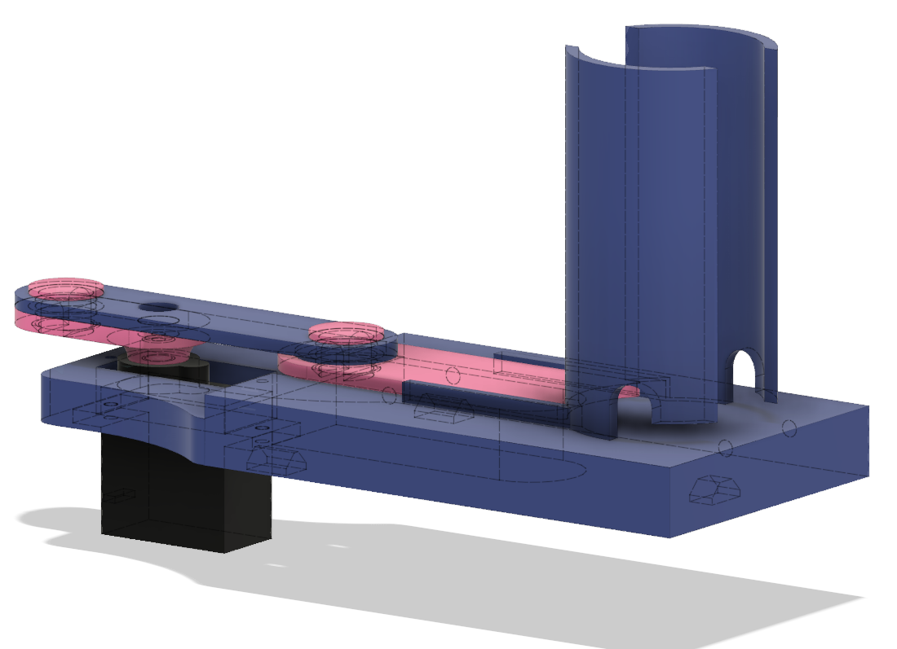
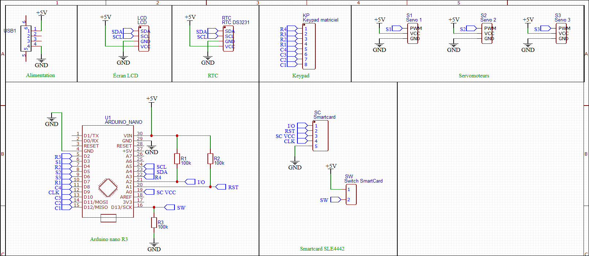

# Distributeur Automatique d'Argent de Poche

Richard Fagot

:::notes

1. Tiens-toi bien ;
1. Pense à ta première phrase ;
1. Prend une inspiration ;
1. Embrasse la salle d'un regard et lance-toi.

==> Bonjour à tous et bienvenu. Il y a quelques temps avec mon épouse...
:::

# {data-background-image="assets/img/calvin.png" data-background-size="contain"}
<!---->

::: notes
Passer rapidement.

==> Mais on ne s'est pas lancé comme ça...
:::

# 
:::notes
On trouve des règles qu'on a choisi d'appliquer. 

- règles de l'argent de poche :
  - quantité libre,
  - distribution 1x/sem,
  - Pas de privation,
  - not(rémunération),
  - l'enfant dépense librement.

==> L'idée étant qu'ils puissent faire comme les grands...
:::

# 
 * image enfant qui fait omme les grands.

::: notes

==> quitte à faire comme les grands, est-ce qu'on ne pourrait pas aller plus loin ?

:::

# {data-background-image="assets/img/fond-mouvement.png"}
<!-- image du servomoteur {data-background-color="#FDFAFE"}-->
{ height=600px }

:::notes

Passez rapidement pour ne pas perdre l'attention de l'auditoire.

Transforme mvt de rotation en translation alternatif

==> Il y a une colonne de pièce, on pousse celle du dessous...
:::

# 
{ height=600px }

::: notes
  - sujet en soi ;
  - explication des différentes pièces ;
  - penser à la méthode de production.

  ==> vous pourrez venir me voi à l'office hour pour savoir pourquoi il y a un trou dans la bielle.
:::

# {data-background-image="assets/img/impressionPosition.png"}
<!--
{ width=1000px }
-->
:::notes
  => pour maintenir tout ça en place il faut un support.
:::

# 
{ height=700px }

::: notes
  => on peut distribuer, oui, mais combien ? il faut stocker la somme quelque part.
:::

# 
{width="1000px"}

:::notes
  ne pas parler de la secu.
  - ~~carte sécurisée~~ ;
  - connecteur ;
  - on y stocke : code, prénom et somme.

  => il faut interagir avec l'utilisateur.
:::

# 
{height="300px"}
{height="300px"}

::: notes
  ==> Il faut contrôler tout ça.
:::

# 
{ height=600px }

:::notes
  - peu de broches => I2C ;
  - Retour aux bases de l'info : pointeurs, références, gestion de la mémoire (fragmentation).

  ==> Tous ces éléments il faut les connecter pendant le prototypage.
:::

# {data-background-image="assets/img/prototype.jpg"}
<!--{ height=1080px }
{ height=600px }-->

::: notes

  ==> Ce n'est pas utilisable pour le produit final, il faut un PCB.
:::

# {data-background-image="assets/img/circuit.png" data-background-size="90%"}
<!--{ height=650px }-->

::: notes
  - fait avec EasyEDA ;
  - Pas de fils de connection, mais des étiquettes qui permettent de tout ordonner par fonction.

  ==> Cette description logique permet de passer au routage.
:::

# {data-background-image="assets/img/routing_Bleu.png" data-background-size="60%"}
<!--{ height=700px }-->
<!--{ height=600px }-->

::: notes
  - automatique ne marche pas trop ;
  - on fait des aller-retour avec le schéma électronique pour affiner le routage.

  ==> ensuite on imprime et après un peu de chimie et avoir piqué le gemey-maybelline de ma chère moitié.
:::

# {data-background-image="assets/img/dissolvant.jpg" data-background-size="50%"}
<!--{height="700px"}-->

::: notes
comment ne pas perturber avec le solvant.

  ==> c'est bien le flacon rose qu'il faut, on obtient ça.
:::

# {data-background-image="assets/img/PCB étamé.jpg" data-background-size="60%"}
<!--{ width=800px }-->

::: notes
  ==> après perçage et soudage on obtient un résultat bien plus propre que le tas de nouille.
:::

# {data-background-image="assets/img/Circuit imprimé.jpg" data-background-size="40%"}
<!--{ width=700px }-->

::: notes
  ==> Tout ça c'est beau mais il faudrait un beau boitier pour ranger le tout.
  ==> Et après de nombreux tests.
:::

# {data-background-image="assets/img/tests.png"}

# 
{ width=800px }

# 
{ width=800px }

# Démo
[{ width=500px }](assets/video/demo.mp4 "Démo")

# 

* 2 mois de travail++ ;
* Mécanique, Conception/Impression 3D, Électronique, Arduino, PCB, soudure... ;

# Office Hour