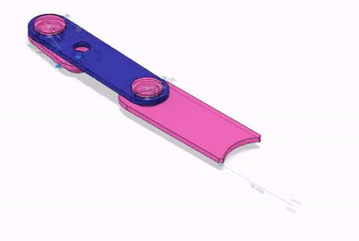
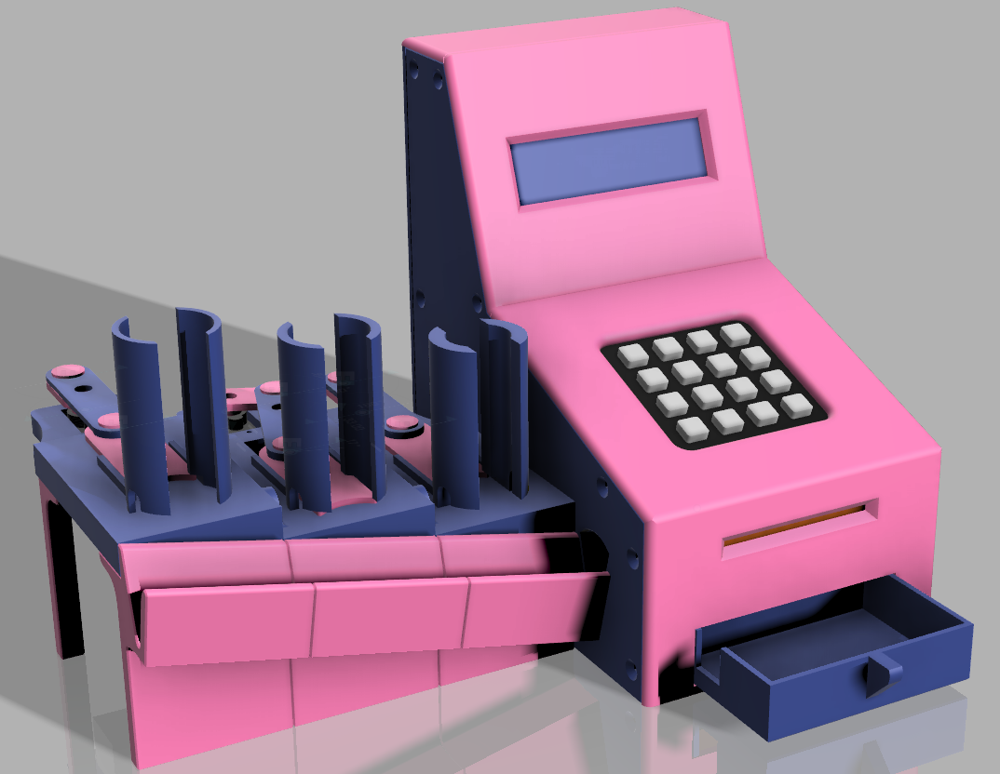

<!-- Phrase d'introduction -->
# Distributeur Automatique d'Argent de Poche

Richard Fagot

:::notes
supprimer le cadre noir des images. Parler un peu plus des problèmes.

1. Tiens-toi bien ;
1. Pense à ta première phrase ;
1. Prend une inspiration ;
1. Embrasse la salle d'un regard et lance-toi.
:::

<!-- Extrait BD de Calvin & Hobbs-->
# 

::: notes
Passer rapidement.

==> littérature sur le sujet
:::

<!-- Courte introduction à l'argent de poche et genèse du projet -->
# 

:::notes
On trouve des règles qu'on a choisi d'appliquer. +image enfant qui fait omme les grands.

- règles de l'argent de poche :
  - quantité libre,
  - distribution 1x/sem,
  - Pas de privation,
  - not(rémunération),
  - l'enfant dépense librement.

==> quitte à faire comme les grands, est-ce qu'on peu aller plus loin ?
:::

# 
{ height=600px }

:::notes
image du servomoteur
Passez rapidement pour ne pas perdre l'attention de l'auditoire.

Transforme mvt de rotation en translation alternatif, idem moteur.

:::

# 
{ height=600px }

::: notes
  - sujet en soi ;
  - explication des différentes pièces ;
  - penser à la méthode de production.
:::

# 
{ width=1000px }

:::notes
  mettre avec les supports et finir avec le troncage de la pièce.
  => pour maintenir tout ça en place il faut un support.
:::

# 
{ height=600px }

::: notes
  => on peut distribuer, oui, mais combien ? il faut stocker la somme quelque part.
:::

# SLE 4442
{height="400px"}

:::notes
  ne pas parler de la secu.
  - carte sécurisée ;
  - connecteur ;
  - on y stocke : code, prénom et somme.

  => il faut interagir avec l'utilisateur.
:::

# 
{height="250px"}
{height="250px"}

::: notes
  ==> Il faut contrôler tout ça.
:::

# 
{ height=600px }

:::notes
  - peu de broches => I2C ;
  - Retour aux bases de l'info : pointeurs, références, gestion de la mémoire (fragmentation).

  ==> Tous ces éléments il faut les connecter pendant le prototypage.
:::

# 
{ height=600px }

::: notes

  ==> Ce n'est pas utilisable pour le produit final, il faut un PCB.
:::

# 
{ height=600px }

::: notes
  - fait avec EasyEDA ;
  - Pas de fils de connection, mais des étiquettes qui permettent de tout ordonner par fonction.

  ==> Cette description logique permet de passer au routage.
:::

# 
{ height=600px }

::: notes
  - automatique ne marche pas trop ;
  - on fait des aller-retour avec le schéma électronique pour affiner le routage.

  ==> ensuite on imprime et après un peu de chimie et avoir piqué le gemey-maybelline de ma chère moitié.
:::

# 
{height="400px"}

::: notes
comment ne pas perturber avec le solvant.

  ==> c'est bien le flacon rose qu'il faut, on obtient ça.
:::

# 
{ width=400px }

::: notes
  ==> après perçage et soudage on obtient un résultat bien plus propre que le tas de nouille.
:::

# 
{ width=500px }

::: notes
  ==> Tout ça c'est beau mais il faudrait un beau boitier pour ranger le tout.
:::

# 
{ width=600px }

# 
{ width=600px }

# Démo
[{ width=500px }](assets/video/demo.mp4 "Démo")

# 
* 2 mois de travail++ ;
* Mécanique, Conception/Impression 3D, Électronique, Arduino, PCB, soudure... ;
* Office Hour.