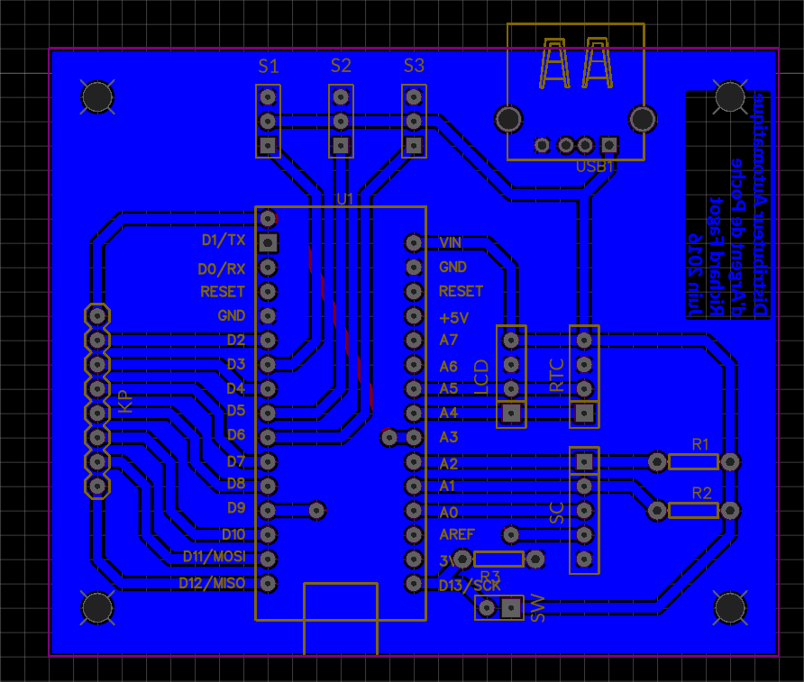
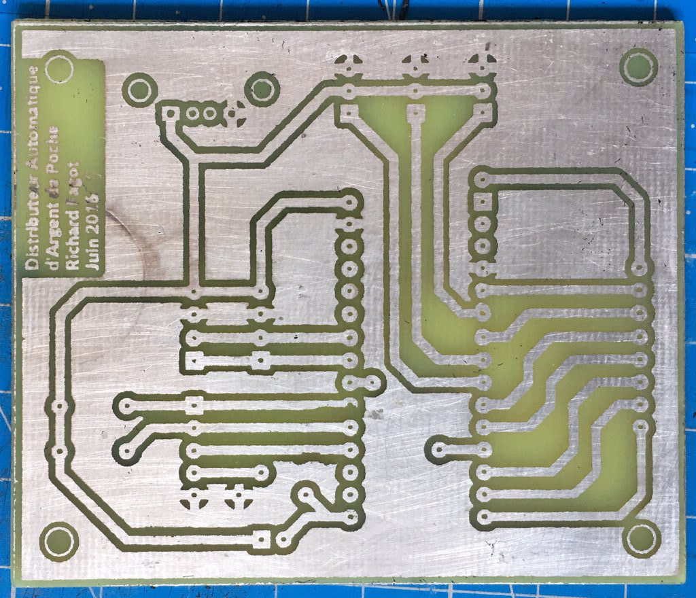

<!-- Phrase d'introduction -->
# Distributeur Automatique d'Argent de Poche

Richard Fagot

:::notes
1. Tiens-toi bien ;
1. Pense à ta première phrase ;
1. Prend une inspiration ;
1. Embrasse la salle d'un regard et lance-toi.
:::

<!-- Extrait BD de Calvin & Hobbs-->
# 

::: notes
Passer rapidement.

==> littérature sur le sujet
:::

<!-- Courte introduction à l'argent de poche et genèse du projet -->
# 

:::notes
- règles de l'argent de poche :
  - quantité libre,
  - distribution 1x/sem,
  - Pas de privation,
  - not(rémunération),
  - l'enfant dépense librement.

==> quitte à faire comme les grands, est-ce qu'on peu aller plus loin ?
:::

# 
{ height=600px }

:::notes
Passez rapidement pour ne pas perdre l'attention de l'auditoire.

- joli ;
- hypnotique ;
- facile à concevoir.

==> il est constitué de != éléments
:::

# 
{ height=600px }

::: notes
**Le poussoir**

- mouvement bielle-manivelle ;
- rotation -> translation.

==> parce que j'aime bien le mouvement
:::

# 
{ width=1000px }

:::notes
  - Toujours penser le design 3D en fonction de la technique de production
  - paramètres d'impression dans Cura (Simplify3D) ;
  - Pros'n Cons des 3 impressions ;
  - insertion manivelle/poussoir ;
  - mouvement rectiligne, support servo, réservoir pièce.

  ==> Je vous présente le support.
:::

# 
{ height=600px }

::: notes

:::

# SLE 4442
{height="400px"}

:::notes
  - carte sécurisée ;
  - connecteur ;
==> on y stocke
:::

# 
{height="250px"}
{height="250px"}

# 
{ height=600px }

:::notes
:::

# 
{ width=500px }

# 
{ height=600px }

# 
{ height=600px }

# 
{ width=400px }

# 
{ width=500px }

# 
{ width=500px }

# 
Sans cahnger les branchements mais uniquement le programme on peut se servir du DAAP comme programmateur de càp, d'éditer l'heure et de daap

# Démonstration