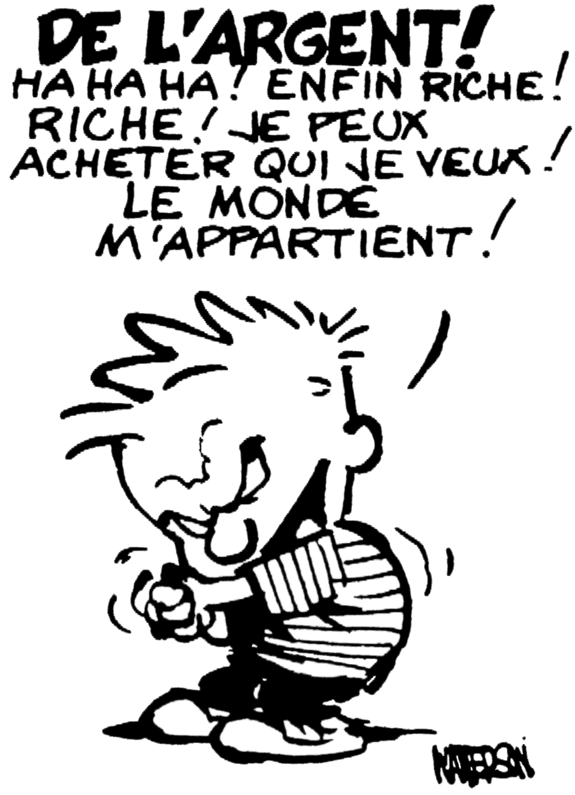
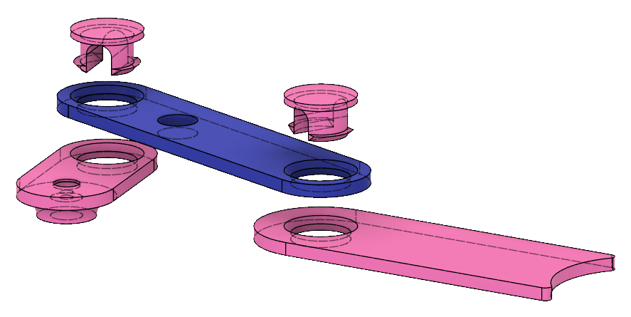
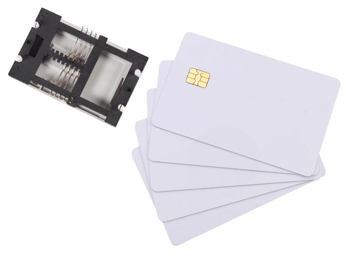

<!-- Phrase d'introduction -->
# Distributeur Automatique d'Argent de Poche

Richard Fagot

:::notes
1. Tiens-toi bien ;
1. Pense à ta première phrase ;
1. Prend une inspiration ;
1. Embrasse la salle d'un regard et lance-toi.
:::


<!-- Pause blagounette -->
# 


::: notes
Passer rapidement.
:::

<!-- Courte introduction à l'argent de poche et genèse du projet -->
#

:::notes
Intro + genèse du projet :

- règles de l'argent de poche ;
- quitte à faire comme les grands, est-ce qu'on peu aller plus loin ?
:::


<!-- Le poussoir -->
# 
{ height=600px }

::: notes
**Le poussoir**
- mouvement bielle-manivelle
:::


#
{ height=600px }

:::notes
Passez rapidement pour ne pas perdre l'attention de l'auditoire.
:::


# 
{ height=600px }

:::notes
**Le poussoir**

- description
- en parler pendant des heures
:::


<!-- Clip -->
#
{ height=600px }

:::notes
- Description du clip ;
- Pièce complexe : penser à l'impression 3D
:::


#
{ width=1000px }

:::notes
  - Pros'n Cons des 3 impressions ;
  - insertion manivelle/poussoir ;
  - mouvement rectiligne, support servo, réservoir pièce.

  ==> Je vous présente le support.
:::


<!-- Le support -->
#
{ height=600px }

::: notes
  - support servo ;
  - guide poussoir ;
  - Diamètre réservoir
  - ouverture réservoir ;
  - rainure réservoir.

  ==> système complet, y' plus qu'à le commander
:::


<!-- Arduino -->
#
{ height=600px }

:::notes
  - Facile à programmer, communauté ;
  - compact ;
  - HE14 à un rang ;
  - nombre de broches ;
  - µC quesako ?

  ==> librairie servo ==> PWM
:::


<!-- PWM -->
# PWM


:::notes
  - rapport cyclique pour générer signaux pseudo analogique ;
  - Pulse Width Modulation
:::


<!-- Contrôler le servo -->
#
```c++
#include <Servo.h>

Servo myServo;
byte position;
byte servoPin;

void setup() {
    myServo.attach(servoPin);
    myServo.write(position);
}

void loop() {...}
```

::: notes

:::

# <!-- Detach -->
```c++
#include <Servo.h>

Servo myServo;
byte position;
byte servoPin;

void setup() {
    myServo.attach(servoPin);
    myServo.write(position);
    myServo.detach();
}

void loop() {...}
```

# <!-- Séquenceur -->
```cpp
CoinPusher *coinPushers[MAX_PUSHER_COUNT];
CoinPusher *sequence[MAX_SEQUENCE_COUNT];

while(remaining != 0) {
  int actualCoinValue = 
     coinPushers[pusherIndex]->getFacialValue();
  byte pushCount = remaining / actualFacialValue;
  for(int i = 0 ; i < pushCount ; i++) {
      sequence[sequenceIndex] = coinPushers[pusherIndex];
      sequenceIndex++;
  }
  remaining -= actualFacialValue * pushCount;
}

```

<!-- Discours -->
#

<!-- SLE 4442 -->
# SLE 4442
{height="400px"}


<!-- Structure carte -->
# 
```cpp
struct {
  char name[20+1];
  int pocketMoney;
  int secret;

  byte nameLength;
};
```

<!-- Discours trouver la librairie SClib-->
# 

<!-- Protocole SLE4442 -->
#
{height="400px"}

<!-- Présentation de L'écran LCD -->
#
{height="400px"}

<!-- Introduction au protocole I2C -->
#
{height="600px"}


<!-- Librairie LCD -->
#
```cpp
#include <LiquidCrystal_PCF8574.h> // by Mathias Hertel

LiquidCrystal_PCF8574 lcd = LiquidCrystal_PCF8574(0x27);

lcd.setCursor(col, row);
lcd.print(message);
```

<!-- Clavier matriciel -->
#
{height="600px"}


<!-- Clavier matriciel fonctionnement-->
#
{height="600px"}


<!-- anti-rebond -->
#
{height="400px"}

#
{height="400px"}


#
{ height=600px }
:::notes
:::