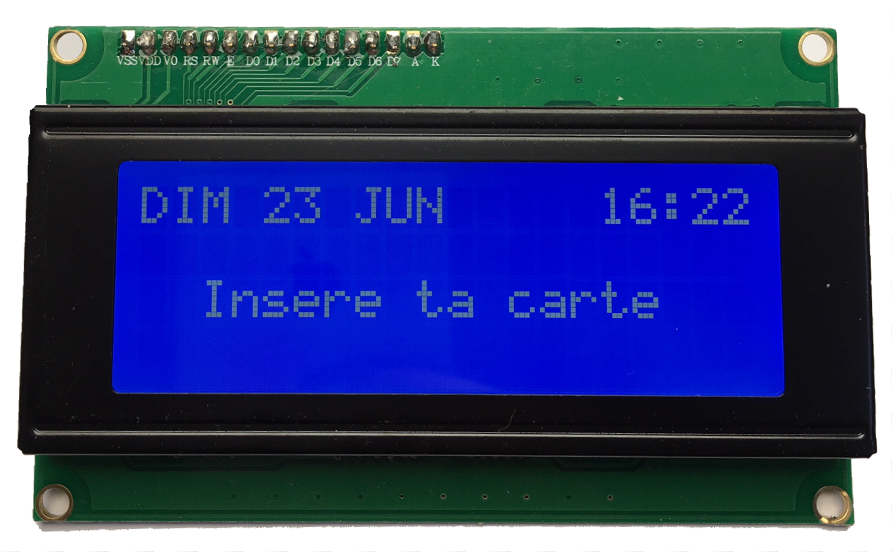

# PWM


# <!-- Contrôler le servo -->
```c++
#include <Servo.h>

Servo myServo;
byte position;
byte servoPin;

void setup() {
    myServo.attach(servoPin);
    myServo.write(position);
}

void loop() {...}
```

::: notes

:::

# <!-- Detach -->
```c++
#include <Servo.h>

Servo myServo;
byte position;
byte servoPin;

void setup() {
    myServo.attach(servoPin);
    myServo.write(position);
    myServo.detach();
}

void loop() {...}
```

# <!-- Séquenceur -->
```cpp
CoinPusher *coinPushers[MAX_PUSHER_COUNT];
CoinPusher *sequence[MAX_SEQUENCE_COUNT];

while(remaining != 0) {
  int actualCoinValue = 
     coinPushers[pusherIndex]->getFacialValue();
  byte pushCount = remaining / actualFacialValue;
  for(int i = 0 ; i < pushCount ; i++) {
      sequence[sequenceIndex] = coinPushers[pusherIndex];
      sequenceIndex++;
  }
  remaining -= actualFacialValue * pushCount;
}

```

<!-- Discours -->
#

<!-- SLE 4442 -->
# SLE 4442
{height="400px"}


<!-- Structure carte -->
# 
```cpp
struct {
  char name[20+1];
  int pocketMoney;
  int secret;

  byte nameLength;
};
```

<!-- Discours trouver la librairie SClib-->
# 

<!-- Protocole SLE4442 -->
#
{height="400px"}

<!-- Présentation de L'écran LCD -->
#
{height="400px"}

<!-- Introduction au protocole I2C -->
#
{height="600px"}


<!-- Librairie LCD -->
#
```cpp
#include <LiquidCrystal_PCF8574.h> // by Mathias Hertel

LiquidCrystal_PCF8574 lcd = LiquidCrystal_PCF8574(0x27);

lcd.setCursor(col, row);
lcd.print(message);
```
<!-- Librairie LCD -->