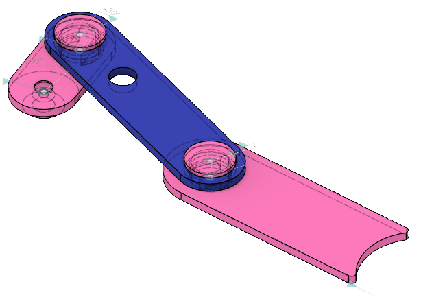
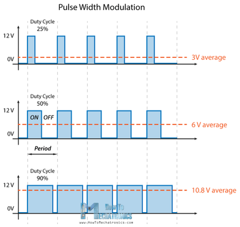
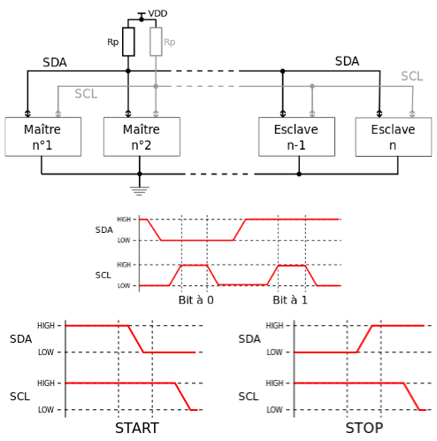
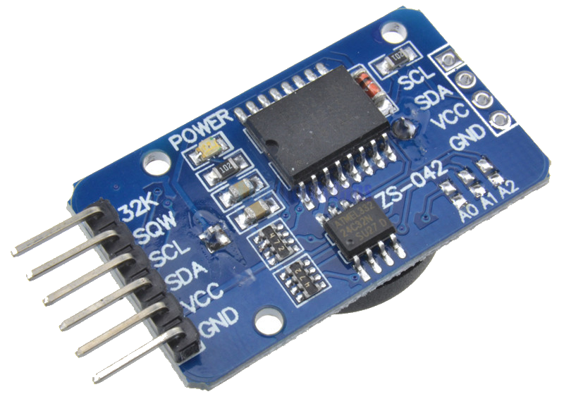
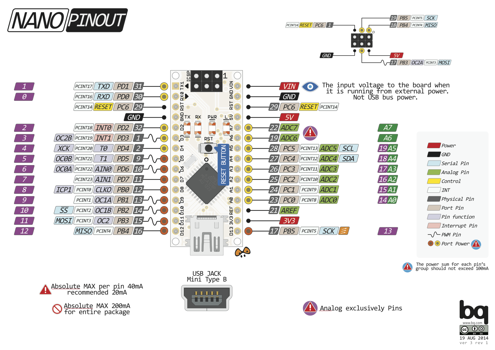

<!-- Phrase d'introduction -->
# Distributeur Automatique d'Argent de Poche

Richard Fagot

:::notes
1. Tiens-toi bien ;
1. Pense à ta première phrase ;
1. Prend une inspiration ;
1. Embrasse la salle d'un regard et lance-toi.
:::


<!-- Pause blagounette -->
# 


::: notes
Passer rapidement.
:::

<!-- Courte introduction à l'argent de poche et genèse du projet -->
#

:::notes
Intro + genèse du projet :

- règles de l'argent de poche (qté libre, 1x/sem, Chq sem, not(rémunération), libre) ;
- quitte à faire comme les grands, est-ce qu'on peu aller plus loin ?
:::


<!-- Le poussoir -->
# 
{ height=600px }

::: notes
**Le poussoir**

- mouvement bielle-manivelle
- rotation -> translation
==> parce que j'aime bien le mouvement
:::


#
{ height=600px }

:::notes
Passez rapidement pour ne pas perdre l'attention de l'auditoire.

- joli
- hypnotique
- facile à concevoir
==> il est constitué de != éléments
:::


# 
{ height=600px }

:::notes
**Le poussoir**

- description + servo;
- axes qui maintiennent les pièces ensembles lego
==> essai paramètre fexibilité, jeu je suis arrivé à ça.
:::


<!-- Clip -->
#
{ height=600px }

:::notes
- Description du clip ;
- Pièce complexe : penser à l'impression 3D
:::


#
{ width=1000px }

:::notes
  - Pros'n Cons des 3 impressions ;
  - insertion manivelle/poussoir ;
  - mouvement rectiligne, support servo, réservoir pièce.

  ==> Je vous présente le support.
:::


<!-- Le support -->
#
{ height=600px }

::: notes
  - support servo ;
  - guide poussoir ;
  - Diamètre réservoir
  - ouverture réservoir ;
  - rainure réservoir.

  ==> système complet, y' plus qu'à le commander
:::


<!-- Arduino -->
#
{ height=600px }

:::notes
  - Facile à programmer, communauté ;
  - compact ;
  - HE14 à un rang ;
  - nombre de broches ;
  - µC quesako ?

  ==> arduino fourni pleins de librairies : servo (PWM?)
:::


<!-- PWM -->
## PWM


:::notes
  - rapport cyclique pour générer signaux pseudo-analogiques ;
  - Pulse Width Modulation
  ==> en terme d'api c'est très facile à utiliser
:::


<!-- Contrôler le servo -->
#
```c++
#include <Servo.h>

Servo myServo;
byte position;
byte servoPin;

void setup() {
    myServo.attach(servoPin);
    myServo.write(position);
    delay(1000);
    myServo.detach();
}

void loop() {...}
```

::: notes
==> système de distribution, combien à distribuer ?
:::


<!-- Séquenceur 
## 
```cpp
CoinPusher *coinPushers[MAX_PUSHER_COUNT];
CoinPusher *sequence[MAX_SEQUENCE_COUNT];

while(remaining != 0) {
  int actualCoinValue = 
     coinPushers[pusherIndex]->getFacialValue();
  byte pushCount = remaining / actualFacialValue;
  for(int i = 0 ; i < pushCount ; i++) {
      sequence[sequenceIndex] = coinPushers[pusherIndex];
      sequenceIndex++;
  }
  remaining -= actualFacialValue * pushCount;
}
```
-->

<!-- Stockage quantité -->
#
:::notes
  - dans le code :
    - pas sexy,
    - flasher arduino si changement
  - dans une mémoire extérieur : la carte à puce
:::


<!-- SLE 4442 -->
# SLE 4442
{height="400px"}

:::notes
  - carte sécurisée ;
  - connecteur ;
==> on y stocke
:::

<!-- Structure carte -->
# 
```cpp
struct {
  char name[20+1];
  int pocketMoney;
  int secret;

  byte nameLength;
};
```

:::notes
  ==> ça a l'air facile comme ça mais lib dure à trouver.
:::


<!-- Discours trouver la librairie SClib-->
# 

:::notes
  - faillit abandonner
==> lib implémente SLE4442, par exemple
:::

<!-- Protocole SLE4442 -->
#
{height="400px"}

:::notes
==> c'est ce qu'il se passe quand l'enfant insère la carte dans la machine, qui, par ailleur l'y invitait via LCD.
:::


<!-- Présentation de L'écran LCD -->
#
{height="400px"}

:::notes
  - 20x4
  - plein de lib
  - mais 6 broches
==> toujours chercher un peu pour diminuer le nombre de broches, I2C très répandu et par défaut dans arduino+pattes
:::


<!-- Introduction au protocole I2C -->
#
{height="600px"}

:::notes
==> implémenté dans la lib Wire.h qui est utilisée dans la lib de l'écran qui est aussi simple d'utilisation.
:::


<!-- Librairie LCD -->
#
```cpp
#include <LiquidCrystal_PCF8574.h> // by Mathias Hertel

LiquidCrystal_PCF8574 lcd = LiquidCrystal_PCF8574(0x27);

lcd.setCursor(col, row);
lcd.print(message);
```
:::notes
==> fonctions utilitaire, effacer pour afficher d'autres messages comme demander de saisir le code.
:::


<!-- Clavier matriciel -->
#
{height="600px"}

:::notes
  - clavier 4x4 rigide ;
  - principe de fonctionnement ;
  - 8 broches !!!!! I2C possible mais faut le faire soi-même.
==> On a un système qui commence à être pas mal, mais il y a une règle : 1 fois par semaine.
:::


<!-- anti-rebond 
#
{height="400px"}

:::note
:::

#
{height="400px"}

:::note
:::

-->


<!-- RTC -->
#
{height="400px"}

:::notes
  - horloge temps réél (DS3231)
  - getMillis() 50J (u_long 32 bit)
  - très peu de dérive (voire pas), temperature
  - DS1307 +1s/jour
:::

#
```cpp
#include <ds3231.h> //ds3231FS by Petre Rodan
ts timeDetails;

DS3231_get(&timeDetails);

timeDetails.wday;
```

:::notes
  - mise à l'heure se fait avec un des programmes d'exemple ;
  - système plutôt complet ;
  - mais il va être mis entre les de hackers en herbe.
==> j'ai confiance mais c'est une occasion de programmer l'EEPROM de l'arduino.
:::


#
{ height=600px }
:::notes
:::


#

  - [Design de connections en 3D](https://www.3dhubs.com/knowledge-base/how-design-snap-fit-joints-3d-printing)
  - [Keypad I2C](https://playground.arduino.cc/Main/I2CPortExpanderAndKeypads/)