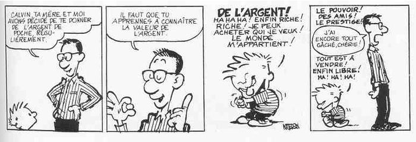

# L'argent de poche




::: notes

- Décision de donner des sous aux enfants ;
- Règles de l'argent de poche ;
- Quite à faire comme les grands autant pousser jusqu'au bout ;
- Projet fun pour les enfants ;
- (et fun pour le papa).

:::

# Le projet

:::::::::::::: {.columns}
::: {.column width="40%"}
contents...
:::
::: {.column width="60%"}
contents...
:::
::::::::::::::

::: notes

- Utiliser la photo du distributeur pour expliquer le workflow :
    - Insertion d'une carte à puce,
    - Saisie du code secret,
    - Distribution de l'argent,
    - Uniquement le week-end ;

- Présenter chaque partie par un éclaté progressif :
    - le poussoir,
    - la carte à puce,
    - le clavier,
    - l'écran,
    - le module RTC,
    - le boitier,
    - l'arduino pour les contrôler tous.

:::


# Le mécanisme de distribution
 - Le poids des pièces ;
 - Le système bielle-manivelle.

# Le système de saisie
- écran / clavier

# Gestion de l'heure
-RTC

# L'impression 3D

# L'Arduino

```cpp
void setup() {

}

void loop() {
    
}

```