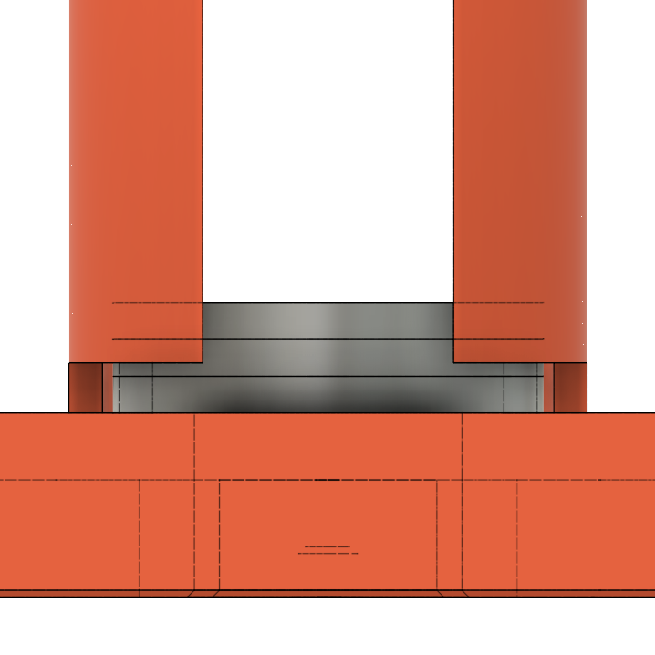

# Distributeur Automatique d'Argent de Poche

Richard Fagot

:::notes
1. Tiens-toi bien ;
1. Pense à ta première phrase ;
1. Prend une inspiration ;
1. Embrasse la salle d'un regard et lance-toi.
:::


# 


::: notes
Passer rapidement.
:::


#
::: notes
Histoire du projet

- Décision de donner des sous aux enfants ;
- Règles de l'argent de poche ;
- Quitte à faire comme les grands autant aller jusqu'au bout ;
- Projet fun pour les enfants ;
- (et fun pour le papa).
- Présenter le workflow.
    
:::


# Roue trieuse
::: notes
- Roue trieuse ;
- ==> pas assez sexy.
:::


# 
{ height=600px }

::: notes
**Le poussoir **

- http://subaru.univ-lemans.fr/AccesLibre/UM/Pedago/physique/02/meca/bielle.html
- conception 3D fusion 360 ;
- Impression en une fois ;
- Puis en plusieurs pièces pour pouvoir avoir plusieurs couleurs ;
- Raffinement à cause de la nouvelle visserie des servos
- Clipper les pièces ensembles ;
- ==> mécanisme retenu.
:::


#
{ height=600px }

::: notes
**Assemblage des axes**

- Sens d'impression ;
- ==> Liaison ???
:::


#
{ height=600px }

::: notes
- colonne de pièces ;
- guidage du poussoir ;
- ==> Support du servo
:::


#

::: notes
**Servomoteur**

- force ;
- bruit du maintient en position.
:::


#
{ height=600px }


::: notes

:::


# 
{ height=600px }

::: notes

:::

# Fusion 360
Demo !

::: note
- Extrusion et opérations booléénes
- liaisons
- les contraintes de l'impression 3D (porte à faux, résistance)
:::

# Slicing
Demo !

# Le système de saisie
- écran / clavier

# Gestion de l'heure
-RTC

# L'impression 3D

# L'Arduino
Le C++ c'est l'enfer : déclaration d'un int et d'un char [20] mais lecture de 21 caractère écrase une partie du int.
```cpp
void setup() {

}

void loop() {

}

```


# My Little Hackers
Empêcher les enfants de hacker le système


# Évolution

- Transformer les distributeurs en petits robots autonomes.
- DAAP Reloaded : Coder en arduino avec **Rust**
- Ajouter un configurateur (nombre de distributeurs, valeur faciale, actualiser l'heure **/!\ à la qté de String**)
- Editer une carte à puce directement via le DAAP.

::: notes

Transformer les distributeurs en petits robots automnomes (par exemple avec une tête de chat) placés dans une petite niche.
Quand l'enfant insère sa carte ils se mettent à trépigner d'impatience.
Une fois la carte retirée ils foncent vers un bol pour cracher par leur petite bouche les pièces qu'il faut.

:::
